# PayMyBuddy - Déploiement avec Docker

Ce dépôt contient la **dockerisation** de l'application **PayMyBuddy**, une application de gestion de transactions financières entre amis.

L'application est composée de deux services :

- un **backend Spring Boot** (Java 17), qui expose l'application web sur le port **8080** ;
- une **base de données MySQL 8.0**, qui stocke les utilisateurs, les comptes bancaires, les connexions et les transactions, sur le port **3306**.

---

## Sommaire

1. [Contexte et objectifs](#1-contexte-et-objectifs)
2. [Architecture](#2-architecture)
3. [Structure du dépôt](#3-structure-du-dépôt)
4. [Prérequis](#4-prérequis)
5. [Étape 1 - Build et test des conteneurs](#5-étape-1---build-et-test-des-conteneurs)
6. [Gestion sécurisée des identifiants](#6-gestion-sécurisée-des-identifiants)
7. [Étape 2 - Orchestration avec Docker Compose](#7-étape-2---orchestration-avec-docker-compose)
8. [Étape 3 - Registre Docker privé](#8-étape-3---registre-docker-privé)
9. [Déployer le projet à partir de zéro](#9-déployer-le-projet-à-partir-de-zéro)
10. [Commandes utiles](#10-commandes-utiles)
11. [Conclusion](#11-conclusion)

---

## 1. Contexte et objectifs

L'infrastructure actuelle de PayMyBuddy est **fortement couplée** et **déployée manuellement**, ce qui la rend lente et difficile à reproduire. L'objectif de ce POC (preuve de concept) est de démontrer qu'elle peut être déployée entièrement avec **Docker**, en suivant les bonnes pratiques :

- **dockeriser** le backend et la base de données ;
- **orchestrer** les services avec **Docker Compose** ;
- **sécuriser** la configuration (aucun mot de passe en clair dans les fichiers versionnés) ;
- **versionner** les images et les stocker dans un **registre Docker privé**.

---

## 2. Architecture

```
                 Navigateur (http://localhost:8080)
                               |
                               v
   +-------------------------------------------------------+
   |              Réseau Docker : paymybuddy-net           |
   |                                                       |
   |   +----------------------+     +-------------------+  |
   |   |  paymybuddy-backend  | --> |   paymybuddy-db   |  |
   |   |  Spring Boot (8080)  |     |   MySQL 8.0 (3306)|  |
   |   +----------------------+     +-------------------+  |
   |                                          |            |
   +------------------------------------------|------------+
                                              v
                                 Volume persistant : db-data

   Registre privé : paymybuddy-registry (localhost:5000)
     - paymybuddy-backend:1.0
     - paymybuddy-db:1.0
```

| Composant | Image | Port | Rôle |
|---|---|---|---|
| **paymybuddy-backend** | **localhost:5000/paymybuddy-backend:1.0** | 8080 | Application web Spring Boot |
| **paymybuddy-db** | **localhost:5000/paymybuddy-db:1.0** | 3306 | Base de données MySQL |
| **paymybuddy-registry** | **registry:2** | 5000 | Registre Docker privé |

---

## 3. Structure du dépôt

```
paymybuddy/
├── Dockerfile              # Image du backend
├── docker-compose.yml      # Orchestration des services
├── .env.example            # Modèle des variables d'environnement
├── .gitignore              # Exclut le fichier .env de Git
├── .dockerignore           # Exclut .git et .env des images
├── initdb/
│   └── create.sql          # Création de la base, des tables et des données de test
├── screenshots/            # Captures d'écran du projet
├── src/                    # Code source Java
├── target/
│   └── paymybuddy.jar      # Application compilée
└── pom.xml                 # Configuration Maven
```

Le fichier **.env**, qui contient les vrais identifiants, n'est **pas versionné**.

---

## 4. Prérequis

- **Docker** et **Docker Compose** installés (projet réalisé avec Docker Desktop et WSL2 Ubuntu) ;
- les ports **8080**, **3306** et **5000** libres sur la machine.

Le fichier **paymybuddy.jar** étant fourni dans **target/**, **aucune compilation Maven** n'est nécessaire.

---

## 5. Étape 1 - Build et test des conteneurs

Avant d'utiliser Docker Compose, chaque composant a été **testé séparément** pour valider son fonctionnement.

### 5.1 Dockerfile du backend

Le contenu complet se trouve dans le fichier **Dockerfile** à la racine du projet.

| Instruction | Rôle |
|---|---|
| **FROM** | Image de base **amazoncorretto:17-alpine** : Java 17 sur Alpine Linux, une distribution légère |
| **WORKDIR** | Crée et utilise le dossier **/app** dans le conteneur |
| **COPY** | Copie **target/paymybuddy.jar** dans l'image |
| **EXPOSE** | Documente le port **8080** utilisé par Spring Boot |
| **CMD** | Lance l'application avec **java -jar** au démarrage du conteneur |

Construction de l'image :

```bash
docker build -t paymybuddy-backend .
```

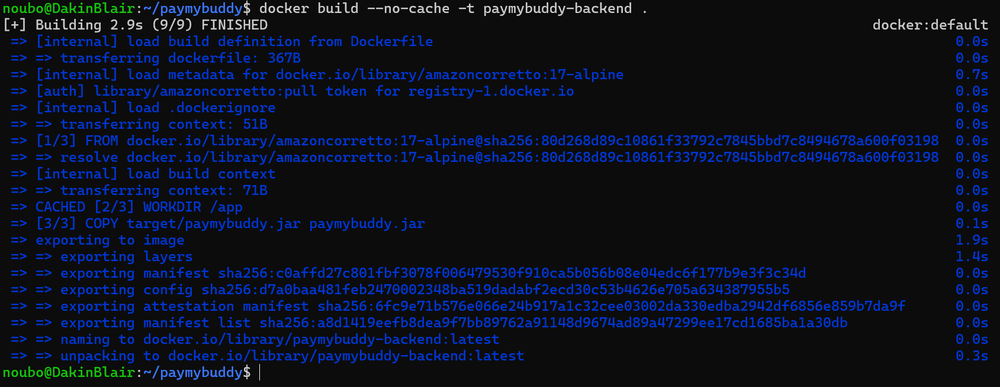

L'image **paymybuddy-backend** est créée. Elle occupe **536 Mo** sur le disque (**192 Mo** compressée), dont la majeure partie correspond au JDK Java.

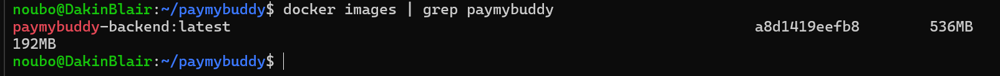

### 5.2 Base de données MySQL seule

Un **réseau** (**paymybuddy-net**) et un **volume** (**paymybuddy-db-data**) ont d'abord été créés, puis MySQL a été lancé avec l'image officielle **mysql:8.0** :

- le **réseau** permet au backend de joindre la base par son **nom de conteneur** (**paymybuddy-db**) au lieu d'une adresse IP ;
- le **volume** conserve les données même si le conteneur est supprimé ;
- le dossier **initdb** est monté dans **/docker-entrypoint-initdb.d** : MySQL exécute automatiquement le script **create.sql** au **premier démarrage**.

Le script **create.sql** crée la base **db_paymybuddy**, ses **4 tables** (**user**, **bank_account**, **connection**, **transaction**) et insère des **données de test** (5 utilisateurs, 4 comptes bancaires, 6 connexions, 3 transactions).

**Remarque importante :** comme le script contient déjà **CREATE DATABASE db_paymybuddy**, la variable **MYSQL_DATABASE** n'est **volontairement pas utilisée**. Sinon, MySQL créerait la base en premier et le script échouerait, sans créer les tables.

La vérification avec **SHOW TABLES** et **SELECT** confirme que la base est initialisée :

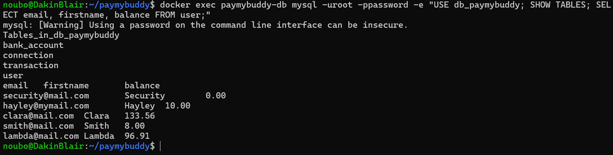

### 5.3 Backend connecté à la base

Le backend ne contient **aucun fichier de configuration** de connexion. Spring Boot lit ses paramètres dans des **variables d'environnement** :

| Variable | Rôle |
|---|---|
| **SPRING_DATASOURCE_URL** | Adresse de la base : **jdbc:mysql://paymybuddy-db:3306/db_paymybuddy** |
| **SPRING_DATASOURCE_USERNAME** | Utilisateur MySQL |
| **SPRING_DATASOURCE_PASSWORD** | Mot de passe MySQL |

Les deux conteneurs tournent :

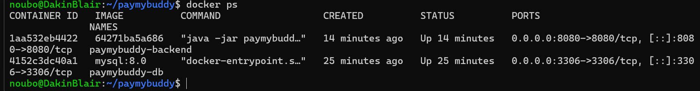

Les logs confirment que l'application a démarré (**Started PayMyBuddyApplication**) et qu'elle a reçu sa première requête HTTP (**Initializing Spring DispatcherServlet**) :

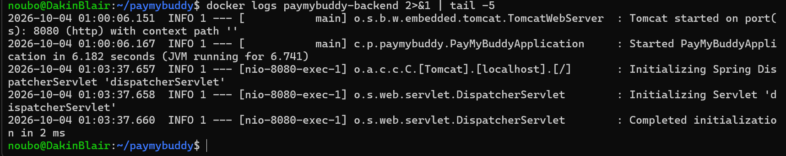

### 5.4 Test de l'application

L'application est accessible sur **http://localhost:8080** :

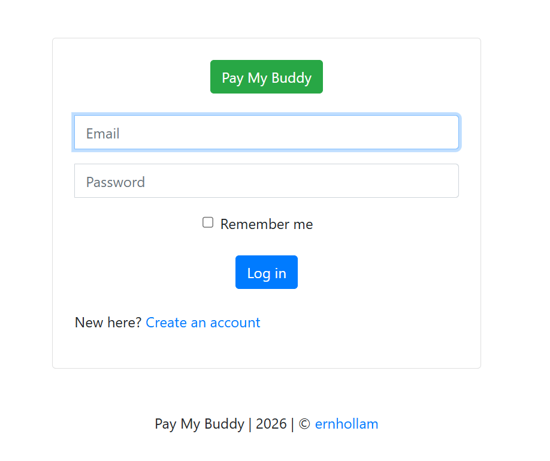

Un compte a été créé via le formulaire d'inscription, puis utilisé pour se connecter :

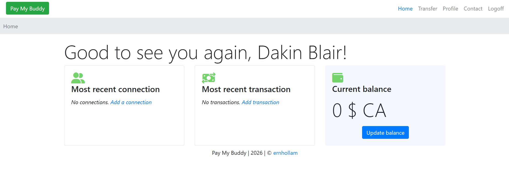

Le nouveau compte apparaît bien dans MySQL (**user_id 6**), ce qui prouve que le backend **lit et écrit** dans la base :

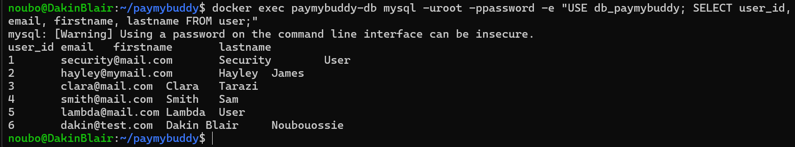

**Note :** cette base de test a ensuite été **supprimée** (conteneurs, volume et réseau) avant de passer à Docker Compose. Le compte visible à l'étape 2 a donc été **recréé** dans une nouvelle base, initialisée automatiquement par **create.sql**.

---

## 6. Gestion sécurisée des identifiants

Pour éviter d'écrire les mots de passe en clair dans les fichiers versionnés, trois fichiers sont utilisés :

| Fichier | Contenu | Versionné |
|---|---|---|
| **.env** | Les vrais identifiants | **Non** |
| **.env.example** | Le modèle des variables, sans vraies valeurs | Oui |
| **.gitignore** | Contient **.env**, pour que Git l'ignore | Oui |

Les variables attendues sont listées dans le fichier **.env.example** : **MYSQL_ROOT_PASSWORD**, **SPRING_DATASOURCE_URL**, **SPRING_DATASOURCE_USERNAME** et **SPRING_DATASOURCE_PASSWORD**.

Docker Compose lit automatiquement le fichier **.env** et remplace les **${...}** du **docker-compose.yml** par leurs valeurs. Le **.dockerignore** exclut également **.env**, pour qu'il ne soit **jamais copié dans une image**.

---

## 7. Étape 2 - Orchestration avec Docker Compose

Docker Compose remplace toutes les commandes manuelles (réseau, volume, **docker run**) par **un seul fichier** et **une seule commande**.

### 7.1 Fichier docker-compose.yml

Le contenu complet se trouve dans le fichier **docker-compose.yml** à la racine du projet. Il définit deux services, **paymybuddy-db** et **paymybuddy-backend**, ainsi que le volume **db-data** et le réseau **paymybuddy-net**.

| Élément | Rôle |
|---|---|
| **environment** avec **${...}** | Les identifiants sont lus dans le **.env**, aucun mot de passe n'est écrit dans le fichier |
| **volumes** | **db-data** assure la **persistance** des données ; **./initdb** initialise la base |
| **healthcheck** | Vérifie toutes les 10 secondes que MySQL **répond réellement** aux connexions |
| **depends_on** + **service_healthy** | Le backend ne démarre **qu'une fois MySQL prêt**, ce qui évite qu'il échoue en démarrant trop tôt |
| **restart: always** | Redémarre automatiquement un conteneur arrêté |
| **networks** | Réseau privé partagé par les deux services |

Le healthcheck interroge MySQL via **127.0.0.1** (connexion réseau) plutôt que par le socket local : pendant son initialisation, MySQL démarre un serveur temporaire sans réseau. Le service n'est donc déclaré **healthy** qu'une fois le vrai serveur prêt.

### 7.2 Lancement

```bash
docker compose up -d
```

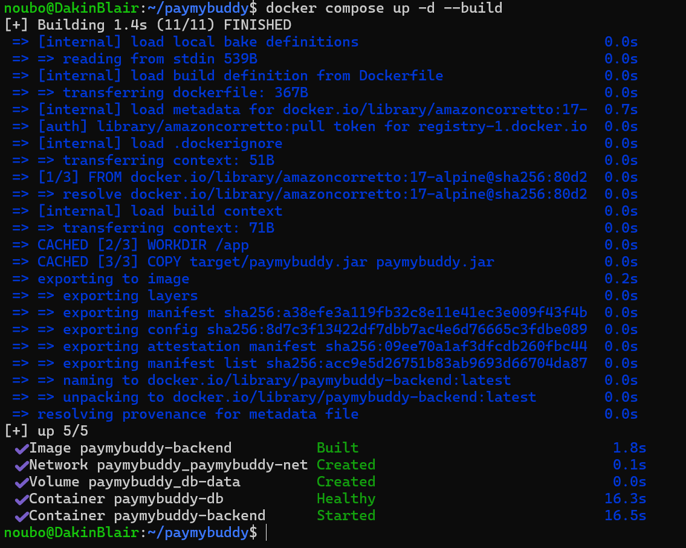

On observe que **paymybuddy-db** passe à l'état **Healthy** (16,3 s), puis que **paymybuddy-backend** démarre juste après (16,5 s) : la dépendance entre les services fonctionne.

Compose crée automatiquement le réseau **paymybuddy_paymybuddy-net** et le volume **paymybuddy_db-data**. Le préfixe **paymybuddy_** est le **nom du projet**, tiré du nom du dossier.

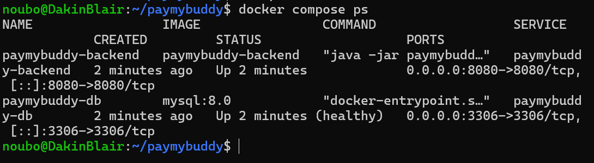

### 7.3 Test de persistance des données

Pour vérifier le volume, un compte a été créé dans l'application, puis les conteneurs ont été **supprimés** (**docker compose down**) et **recréés** (**docker compose up -d**) :

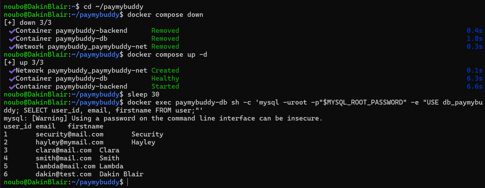

Le compte **dakin@test.com** (**user_id 6**) est **toujours présent** : les conteneurs ont été détruits, mais les données ont été conservées dans le volume.

On remarque aussi que MySQL est **Healthy en 6,3 s**, contre 16,3 s au premier lancement : il a trouvé des données existantes dans le volume et **n'a pas réexécuté** **create.sql**.

---

## 8. Étape 3 - Registre Docker privé

### 8.1 Lancement du registre

Le registre est lancé à partir de l'image officielle **registry:2**, sur le port **5000**. Il stocke ses images dans le volume **registry-data**, pour qu'elles survivent à un redémarrage.

```bash
docker run -d --name paymybuddy-registry -p 5000:5000 \
  -v registry-data:/var/lib/registry --restart always registry:2
```

### 8.2 Étiquetage des images

Pour être poussée dans le registre, une image doit porter son adresse dans son nom (**localhost:5000/...**). Les images sont **versionnées en 1.0**, plutôt que **latest**, pour savoir exactement quelle version est déployée.

```bash
docker tag paymybuddy-backend localhost:5000/paymybuddy-backend:1.0
docker tag mysql:8.0 localhost:5000/paymybuddy-db:1.0
```

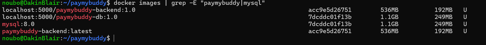

Les nouveaux noms ont le **même IMAGE ID** que les images d'origine : **docker tag** ajoute un nom, **sans dupliquer** l'image.

### 8.3 Envoi des images dans le registre

```bash
docker push localhost:5000/paymybuddy-backend:1.0
docker push localhost:5000/paymybuddy-db:1.0
```

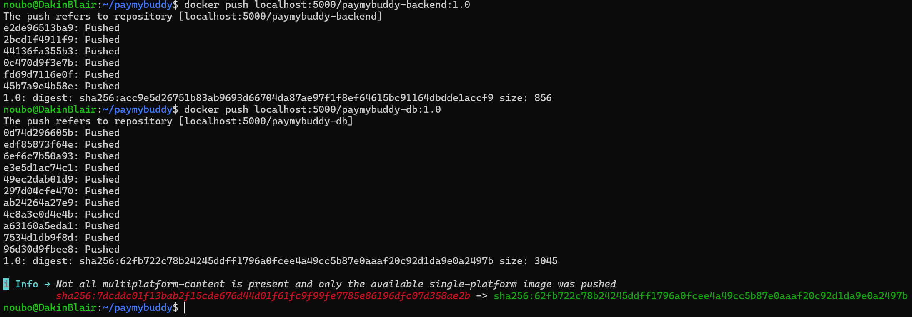

Le message **Info** affiché pour MySQL est normal : l'image officielle **mysql:8.0** est **multi-plateforme**, et seule la version correspondant au processeur de la machine a été téléchargée, puis poussée.

Le contenu du registre est vérifié via son **API** (**/v2/_catalog** et **/v2/.../tags/list**) :

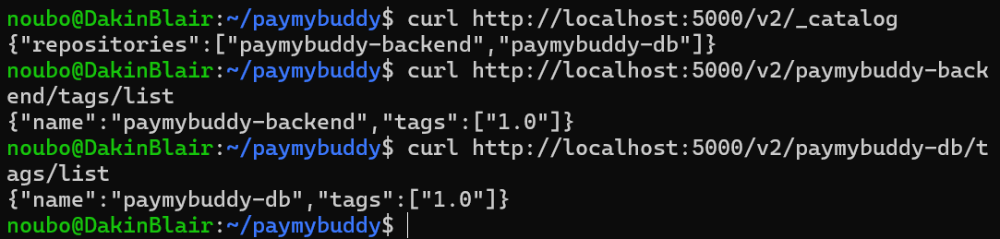

### 8.4 Déploiement depuis le registre

Le **docker-compose.yml** a été modifié pour utiliser les images du registre (**localhost:5000/...:1.0**) au lieu de **mysql:8.0** et de **build: .**.

Pour **prouver** que Compose télécharge bien les images depuis le registre, toutes les **copies locales** ont été supprimées avec **docker rmi** avant de relancer l'application :

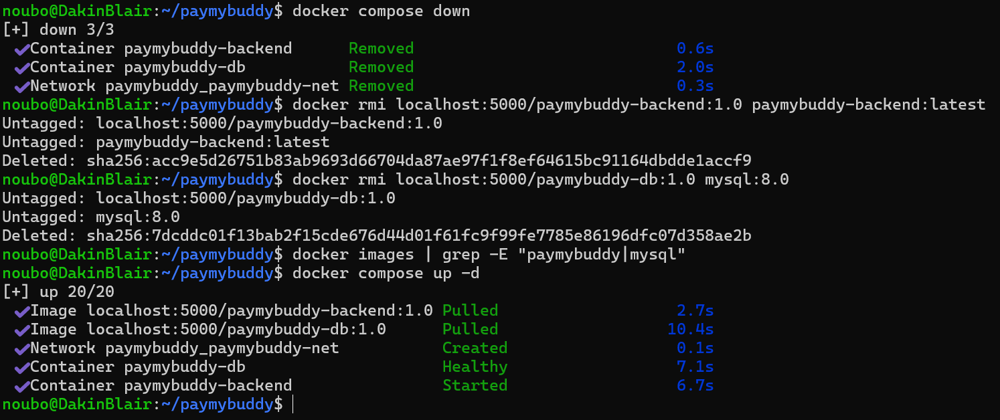

La commande **docker images** ne renvoie **aucun résultat** : plus aucune image n'existe en local. Compose affiche ensuite **Pulled** pour les deux images : elles ont été **téléchargées depuis le registre privé**, puis l'application a démarré.

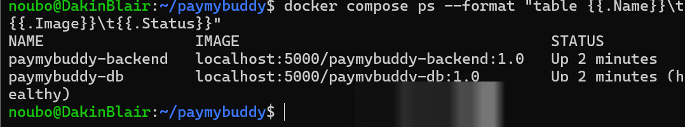

---

## 9. Déployer le projet à partir de zéro

```bash
# 1. Cloner le dépôt
git clone https://github.com/Dakin-blair/paymybuddy.git
cd paymybuddy

# 2. Créer le fichier .env à partir du modèle, puis modifier les mots de passe
cp .env.example .env

# 3. Lancer le registre privé
docker run -d --name paymybuddy-registry -p 5000:5000 \
  -v registry-data:/var/lib/registry --restart always registry:2

# 4. Construire, étiqueter et pousser les images
docker build -t localhost:5000/paymybuddy-backend:1.0 .
docker pull mysql:8.0
docker tag mysql:8.0 localhost:5000/paymybuddy-db:1.0
docker push localhost:5000/paymybuddy-backend:1.0
docker push localhost:5000/paymybuddy-db:1.0

# 5. Lancer l'application
docker compose up -d
```

L'application est ensuite accessible sur **http://localhost:8080**.

---

## 10. Commandes utiles

| Commande | Rôle |
|---|---|
| **docker compose up -d** | Lancer l'application en arrière-plan |
| **docker compose ps** | Voir l'état des services |
| **docker compose logs -f paymybuddy-backend** | Suivre les logs du backend |
| **docker compose down** | Arrêter l'application (les données sont conservées) |
| **docker compose down -v** | Arrêter l'application et **supprimer les données** |
| **curl http://localhost:5000/v2/_catalog** | Lister les images du registre |

---

## 11. Conclusion

Ce POC démontre que PayMyBuddy peut être déployé entièrement avec Docker :

- le backend et la base de données sont **conteneurisés** et testés séparément ;
- **Docker Compose** lance toute l'application en une seule commande, avec une **dépendance contrôlée** entre les services et des **données persistantes** ;
- les **identifiants** sont gérés par un fichier **.env** non versionné ;
- les images sont **versionnées** et distribuées depuis un **registre privé**.
